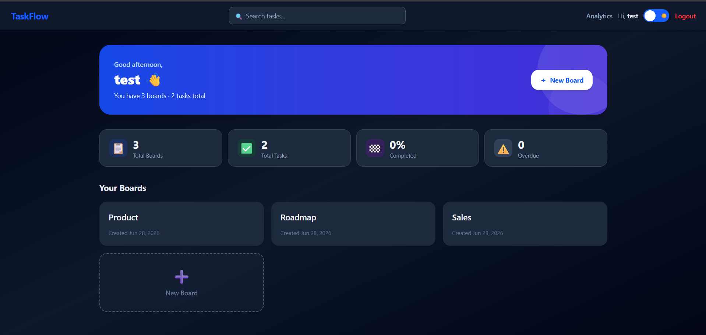
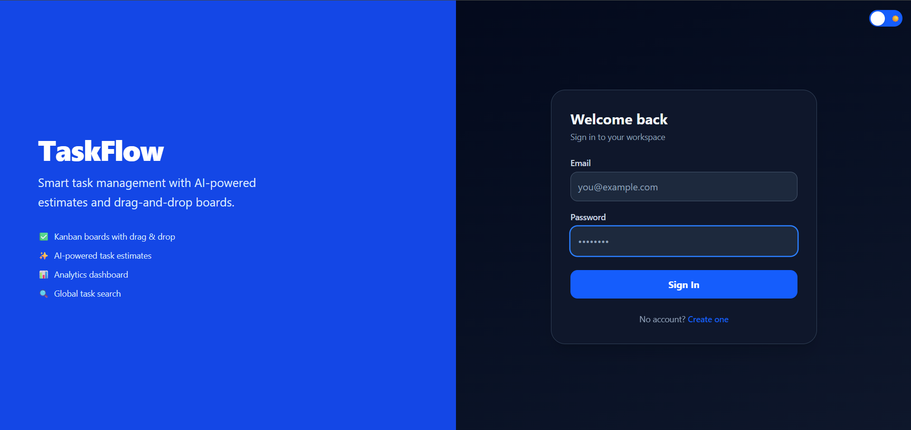
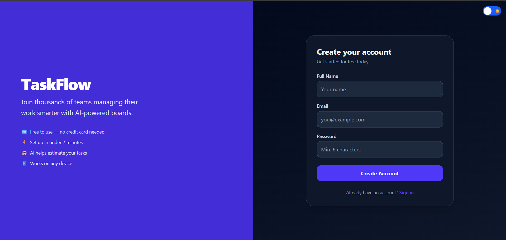
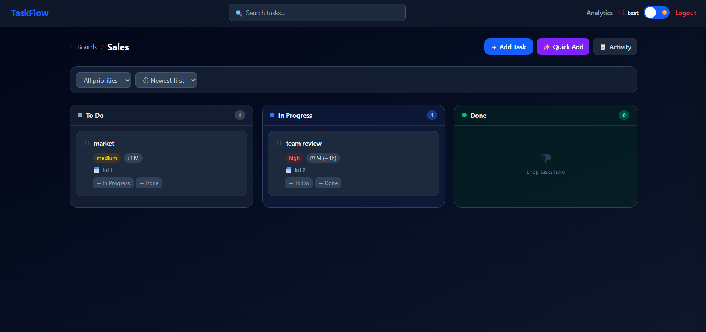
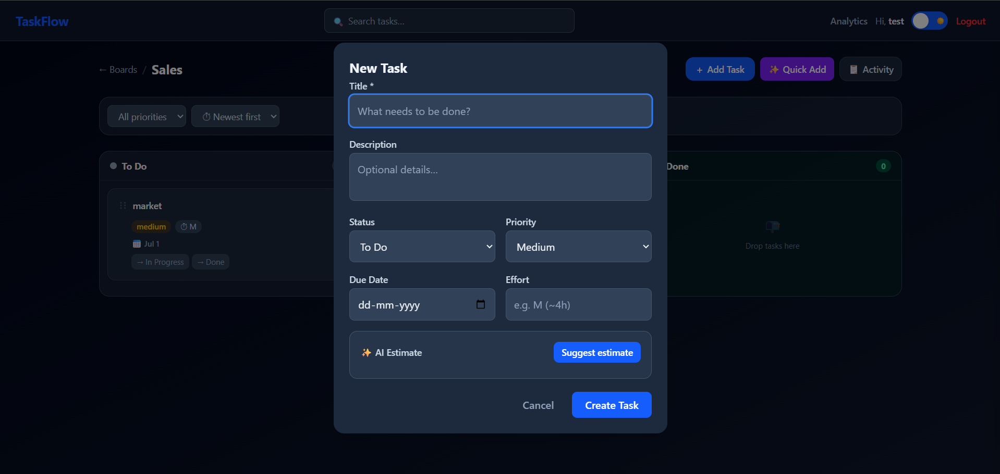
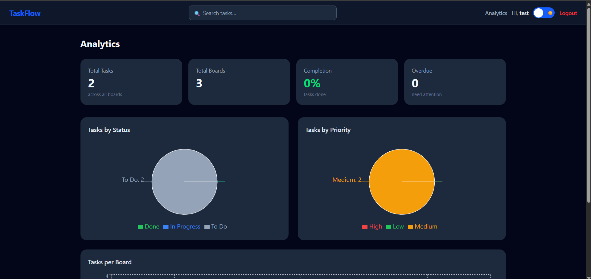
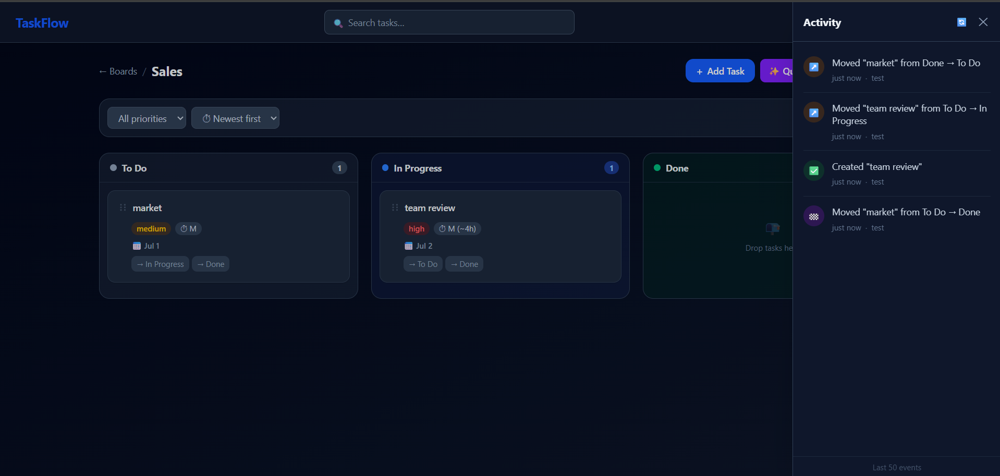
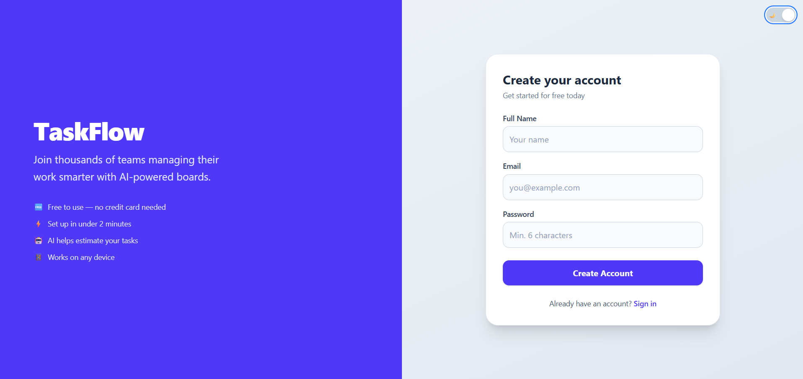
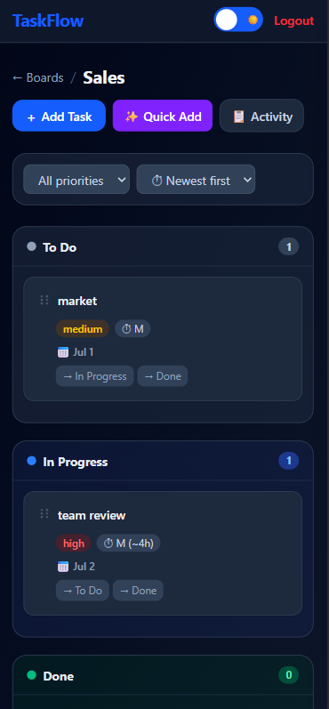
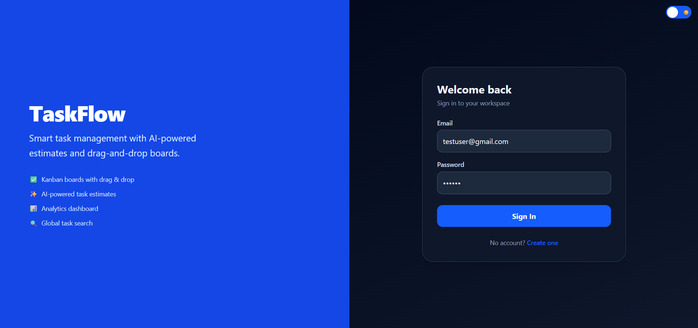

# 🚀 TaskFlow AI

<p align="center">
  
</p>

<p align="center">
  <b>AI-Powered Kanban Task Management System built using the MERN Stack and Google Gemini AI.</b>
</p>

<p align="center">


</p>

---

## 📌 About the Project

TaskFlow AI is a **full-stack AI-powered task management application** developed as part of the **Mandelbulb Technologies Full Stack Developer Assignment**.

The application enables users to organize projects using Kanban boards, manage tasks efficiently, monitor activity, visualize analytics, and leverage **Google Gemini AI** for intelligent task estimation and natural language task parsing.

---

# 📑 Table of Contents

- [Assignment Objectives](#-assignment-objectives)
- [Highlights](#-highlights)
- [Features](#-features)
- [Tech Stack](#️-tech-stack)
- [Project Structure](#-project-structure)
- [Environment Variables](#-environment-variables)
- [Installation](#️-installation)
- [REST API Endpoints](#-rest-api-endpoints)
- [Authentication](#-authentication)
- [AI Integration](#-ai-integration)
- [Application Screenshots](#-application-screenshots)
- [Future Improvements](#-future-improvements)
- [Author](#-author)
- [License](#-license)

---

# 📌 Assignment Objectives

This project successfully implements:

- ✅ JWT Authentication
- ✅ Board Management
- ✅ Task CRUD Operations
- ✅ Kanban Board Interface
- ✅ Activity Logging
- ✅ Analytics Dashboard
- ✅ Google Gemini AI Integration
- ✅ AI Task Estimation
- ✅ Natural Language Task Parsing
- ✅ MongoDB Database
- ✅ RESTful API
- ✅ Responsive User Interface

---

# ⭐ Highlights

- 🔐 Secure JWT Authentication
- 📋 Kanban Board Task Management
- 🤖 Google Gemini AI Integration
- 🧠 AI Task Parsing
- 📊 Analytics Dashboard
- 📝 Activity Logging
- 📱 Responsive Design
- 🌙 Light/Dark Theme Support
- ⚡ RESTful API Architecture

---

# ✨ Features

## 🔐 Authentication

- User Registration
- User Login
- JWT Authentication
- Protected Routes
- Secure Password Hashing using bcrypt

---

## 📋 Board Management

- Create Boards
- Update Boards
- Delete Boards
- View All Boards

---

## ✅ Task Management

Each task supports:

- Title
- Description
- Priority
- Status
- Due Date
- Estimated Effort
- Assigned Board

Users can:

- Create Tasks
- Edit Tasks
- Delete Tasks
- Move Tasks across Kanban columns
- Search Tasks

---

## 🤖 AI Features

### AI Task Estimation

Google Gemini automatically suggests:

- Estimated effort
- Estimated hours
- Suggested due date
- AI reasoning

---

### Natural Language Task Parsing

Example:

> Finish authentication module by Friday with high priority.

AI extracts:

- Task Title
- Description
- Priority
- Due Date
- Estimated Effort

---

## 📝 Activity Log

Every important action is recorded automatically.

Examples:

- Board Created
- Board Deleted
- Task Created
- Task Updated
- Task Deleted
- Task Status Changed

---

## 📊 Analytics Dashboard

Displays:

- Tasks by Status
- Tasks by Priority
- Completed Tasks
- Pending Tasks
- Overall Productivity

---

## 📱 Responsive UI

Built with:

- React
- Vite
- Tailwind CSS

Supports desktop and mobile devices.

---

# 🏗️ Tech Stack

## Frontend

- React
- Vite
- React Router
- Axios
- Tailwind CSS
- React Hot Toast

### Backend

- Node.js
- Express.js
- MongoDB
- Mongoose
- JWT
- bcryptjs
- dotenv
- CORS

### AI

- Google Gemini API

---

# 📂 Project Structure

```text
TaskFlow/
│
├── backend/
│   ├── config/
│   ├── controllers/
│   ├── middleware/
│   ├── models/
│   ├── routes/
│   ├── utils/
│   ├── .env.example
│   ├── app.js
│   ├── server.js
│   └── package.json
│
├── frontend/
│   ├── src/
│   │   ├── assets/
│   │   ├── components/
│   │   ├── context/
│   │   ├── layouts/
│   │   ├── pages/
│   │   ├── routes/
│   │   ├── services/
│   │   └── App.jsx
│   └── package.json
│
├── screenshots/
├── README.md
└── .gitignore
```

---

# 🔑 Environment Variables

Create a `.env` file inside the **backend** folder.

```env
PORT=5000

MONGO_URI=your_mongodb_connection_string

JWT_SECRET=your_secret_key

GEMINI_API_KEY=your_gemini_api_key
```

---

# ⚙️ Installation

## Clone the Repository

```bash
git clone https://github.com/devanshiv11/taskflow-assignment.git

```bash
cd taskflow-assignment
```

---

## Install Backend

```bash
cd backend
npm install
npm run dev
```

Backend runs on:

```
http://localhost:5000
```

---

## Install Frontend

```bash
cd frontend
npm install
npm run dev
```

Frontend runs on:

```
http://localhost:5173
```

---

# 🔗 REST API Endpoints

## Authentication

| Method | Endpoint |
|---------|----------|
| POST | `/api/auth/register` |
| POST | `/api/auth/login` |

---

## Boards

| Method | Endpoint |
|---------|----------|
| GET | `/api/boards` |
| POST | `/api/boards` |
| PUT | `/api/boards/:id` |
| DELETE | `/api/boards/:id` |

---

## Tasks

| Method | Endpoint |
|---------|----------|
| GET | `/api/tasks` |
| POST | `/api/tasks` |
| PUT | `/api/tasks/:id` |
| DELETE | `/api/tasks/:id` |

---

## AI

| Method | Endpoint |
|---------|----------|
| POST | `/api/ai/suggest` |
| POST | `/api/ai/parse-task` |

---

## Analytics

| Method | Endpoint |
|---------|----------|
| GET | `/api/analytics` |

---

## Activity

| Method | Endpoint |
|---------|----------|
| GET | `/api/activity` |

---

# 🔒 Authentication

All protected endpoints require:

```http
Authorization: Bearer <JWT_TOKEN>
```

---

# 🤖 AI Integration

Google Gemini AI powers:

- Smart task estimation
- Due date suggestions
- Natural language task parsing

If the configured Gemini API key reaches its usage quota or free-tier rate limit, the backend automatically returns predefined fallback responses, ensuring uninterrupted application functionality.
---

# 📸 Application Screenshots

## 🔐 Login

<p align="center">

</p>

---

## 📝 Register

<p align="center">

</p>

---

## 📊 Dashboard

<p align="center">

</p>

---

## 📋 Kanban Board

<p align="center">

</p>

---

## ➕ Create Task

<p align="center">

</p>

---

## 📈 Analytics

<p align="center">

</p>

---

## 📝 Activity Log

<p align="center">

</p>

---

## 🌙 Light Mode

<p align="center">

</p>

---

## 📱 Mobile View

<p align="center">

</p>

---

## 🧪 Test User Login

<p align="center">

</p>

---

# 🚀 Future Improvements

- 👥 Team Collaboration
- 🔔 Email Notifications
- 📅 Calendar View
- 📎 File Attachments
- 💬 Comments
- 🏷️ Labels & Tags
- ⚡ Real-time Updates using Socket.io
- 📱 Progressive Web App (PWA)

---

# 📌 Notes

- `.env` files are intentionally excluded from the repository.
- A `.env.example` file is included for easy setup.
- MongoDB Atlas is used as the primary database.
- Google Gemini AI powers intelligent task suggestions and parsing.

---

# 👩‍💻 Author

**Devanshi Vijay**

Developed as part of the **Mandelbulb Technologies Full Stack Developer Assignment** to demonstrate full-stack MERN development, REST API design, authentication, AI integration, and responsive UI development.

---

# 📄 License

This project was developed solely for the **Mandelbulb Technologies Full Stack Developer Assignment** and educational purposes.